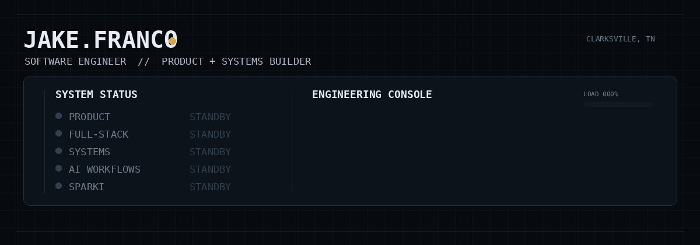
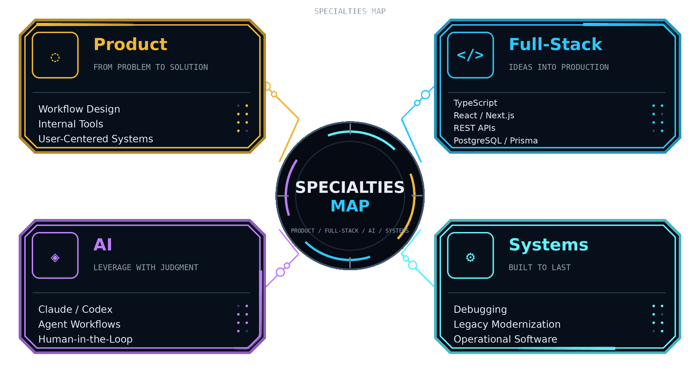

<div align="center">



<br>

<p>
  
  &nbsp;
  
  &nbsp;
  
  &nbsp;
  
</p>

### `> turning messy real-world problems into software that actually makes sense.`

</div>

---

## /about

I build software around **real workflows** — not just features.

My best work tends to sit where **product engineering, full-stack development, systems thinking, workflow design, and AI-assisted execution** overlap.

I’m most interested in software that survives contact with reality — not just clean ideas, but systems people can actually use.

Right now I’m building **Sparki**, a veterinary operations platform shaped around how clinics actually work.

---

## /specialties-map

<div align="center">



</div>

---

## /current-build

### 🐶🩺 [Sparki](https://github.com/jakefr7/sparki-preview)

A veterinary operations platform built from the workflow outward.

```text
Appointment → Check-In → Intake → Exam → Treatment → Checkout
```

**Core areas**

- scheduling
- patient records
- clinical workflows
- inventory
- internal messaging
- role-based operational tools

> Production code remains private while the platform is actively being developed.

---

## /operating-mode

<div align="center">

### `01 DISCOVER` → `02 MODEL` → `03 BUILD` → `04 VERIFY` → `05 SHIP` → `06 ITERATE`

<sub>
understand the workflow &nbsp;•&nbsp;
design the system &nbsp;•&nbsp;
build the solution &nbsp;•&nbsp;
test the edges &nbsp;•&nbsp;
ship with confidence &nbsp;•&nbsp;
learn from reality
</sub>

</div>

---

## /currently-exploring

<div align="center">


</div>

---

## /offline

When I’m not building software, I’m usually:

- outside — racetrack, hiking, basketball
- troubleshooting something mechanical
- producing house music

---

## /signal

<p align="center"><a href="https://www.linkedin.com/in/jake-franco-467326176"></a>&nbsp;&nbsp;&nbsp;<a href="https://github.com/jakefr7"></a></p>

---

<div align="center">

```text
> always building
> usually debugging
> occasionally both at the same time
```

</div>
